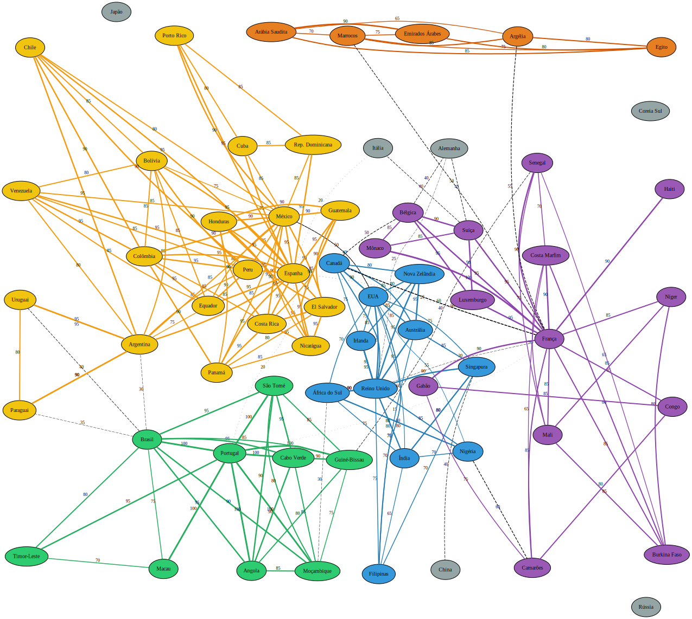

# 🌍 Projeto: Expansão Linguística Internacional
## Sistema de Análise de Barreiras Linguísticas para Expansão de Negócios

### 📊 Estrutura do Grafo

#### 🖼️ Visualização do Grafo

#### **Estatísticas:**
- **65 vértices** (países)
- **180 arestas** (conexões linguísticas)
- **Tipo:** Grafo não-direcionado com peso nas arestas

#### **Grupos Linguísticos:**

1. **🟢 Lusófonos (9 países)**
   - Brasil, Portugal, Angola, Moçambique, Cabo Verde
   - Guiné-Bissau, São Tomé e Príncipe, Timor-Leste, Macau

2. **🟡 Hispanófonos (20 países)**
   - Espanha, México, Argentina, Colômbia, Chile, Peru
   - Venezuela, Equador, Bolívia, Paraguai, Uruguai
   - América Central e Caribe

3. **🔵 Anglófonos (11 países)**
   - EUA, Reino Unido, Canadá, Austrália, Nova Zelândia
   - Irlanda, África do Sul, Índia, Nigéria, Filipinas, Singapura

4. **🟣 Francófonos (14 países)**
   - França, Bélgica, Suíça, Luxemburgo, Mônaco
   - Países africanos francófonos, Haiti

5. **🟠 Países Árabes (5 países)**
   - Egito, Arábia Saudita, Emirados Árabes, Marrocos, Argélia

6. **⚫ Outros (6 países)**
   - Alemanha, Itália, Japão, China, Coreia do Sul, Rússia

### 📈 Interpretação dos Pesos

**Peso das Arestas (0-100):**
- **90-100:** Mesma língua oficial, alta inteligibilidade
- **70-89:** Língua comum com variações regionais
- **50-69:** Língua secundária significativa
- **30-49:** Língua minoritária ou proximidade cultural
- **0-29:** Conexão linguística fraca

### 🎯 Casos de Uso

#### 1. **Netflix/Spotify - Priorização de Conteúdo**
   - Identificar clusters linguísticos para dublagem
   - Otimizar investimento em tradução

#### 2. **Startups - Expansão Internacional**
   - Menor caminho linguístico do Brasil para outros mercados
   - Identificar hubs linguísticos estratégicos

#### 3. **E-commerce - Localização**
   - Grupos de países que podem compartilhar traduções
   - Priorização de mercados por acessibilidade linguística

#### 4. **Educação - Intercâmbio**
   - Rotas de intercâmbio com menor barreira linguística
   - Países-ponte para aprendizado multilíngue

### 🔧 Algoritmos Aplicáveis

1. **Dijkstra** - Caminho mínimo linguístico
2. **Componentes Conexas** - Identificar ilhas linguísticas
3. **Centralidade** - Hubs linguísticos globais
4. **Cliques** - Grupos de países com intercompreensão total
5. **Árvore Geradora Mínima** - Rede de expansão otimizada

### 🌐 Conexão com ODS

- **ODS 8** - Trabalho Decente (oportunidades internacionais)
- **ODS 9** - Inovação (transferência tecnológica)
- **ODS 17** - Parcerias Globais (cooperação internacional)

### 📁 Arquivos

1. **grafo.txt** - Dados do grafo no formato especificado
2. **grafo.dot** - Visualização para Graphviz/Graph Online
3. **README.md** - Esta documentação

---
*Projeto desenvolvido para a disciplina de Teoria dos Grafos*